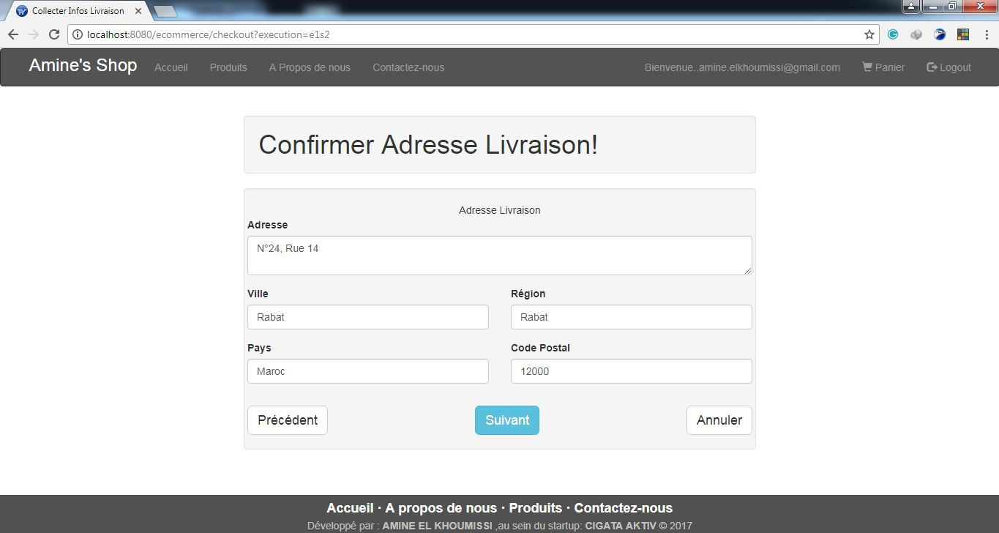

# Nom du projet:        Amine's Shop

---

## Table des matières:

- [Description](#description)
- [Technologies](#technologies)
- [Installation](#installation)
- [Captures](#captures)

---

## Description:

Cette application est un site web de commerce électronique qui permet l'achat en ligne des téléphones portables de la marque Oppo. 
Elle se compose de deux parties:

° Une partie back office qui nécessite une authentification et qui permet de gérer les produits et les utilisateurs. 
Dans cette partie l’administrateur a le droit de :

- consulter tous les produits
- ajouter des produits
- modifier des produits
- supprimer des produits
- gérer les droits d'accès
- consulter des utilisateurs
- supprimer des utilisateurs

◦ Une partie front office qui représente la boutique virtuelle qui ne nécessite pas d’authentification. 
Dans cette partie l’utilisateur a le droit de :

- s'inscrire
- contacter les administrateurs du site
- consulter tous les produits
- consulter les produits sélectionnés
- ajouter un produit avec une quantité au panier
- supprimer un produit du panier
- enregistrer les produits de son panier

---
 
 ## Technologies:

- Base de données H2
- JPA, Hibernate
- Spring MVC
- Spring Security
- Spring Web Flow
- HTML, CSS, JQuery, Bootstrap

---

## Installation:

- Cloner le projet autant que "existing maven project"
- Copier coller les fichier de base de données quis se trouvent dans le chemin:
      dans le répertoire: C:\Users\NomDeVotreOrdinateur, sur votre machine
- cliquer droit-> Run As-> Maven Build
- cliquer droit-> Maven-> Update Project
- cliquer droit-> Properties-> Targeted Runtimes-> cocher "Apache Tomcat v8.5 puis cliquer sur le bouton "OK"
- Lancer l'application (cliquer droit-> Run As-> Run on Server)

---

## Captures:

- Page d'accueil:

- Page de présentation du site:

- Page d'inscription d'un client:

- Page d'authentification:

- Page d'accueil d'un client apèrs authentification:

- Page de la liste des produits consultés par un client:

- Page de contact des administrateurs par un client:

- Page de consultation du panier:

- Page de vérification des détails du client:

- Page de vérification de l'adresse de livraison:

- Page d'édition du reçu:

- Page d'affichage du délai de livrasion:

- Page d'annulation des opérations de vérification:

- Page d'accueil après authentification d'un administrateur:

- Page d'ajout d'un produit par l'administrateur:

- Page de gestion des utilisateurs:

- Page de consultation d'un produit par l'administrateur:

- Page de mise à jour d'un produit par l'administrateur:

---

- [Début de page](#table-des-matières)

